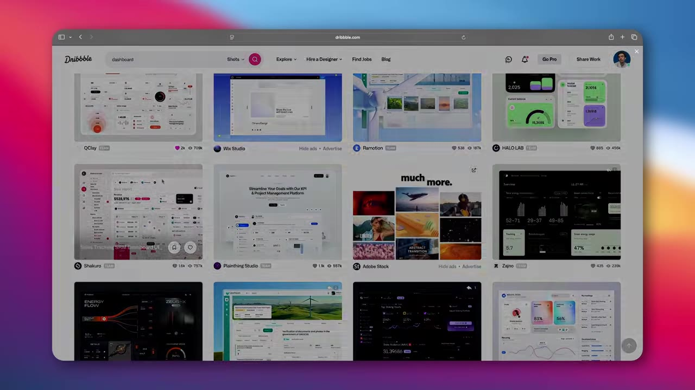
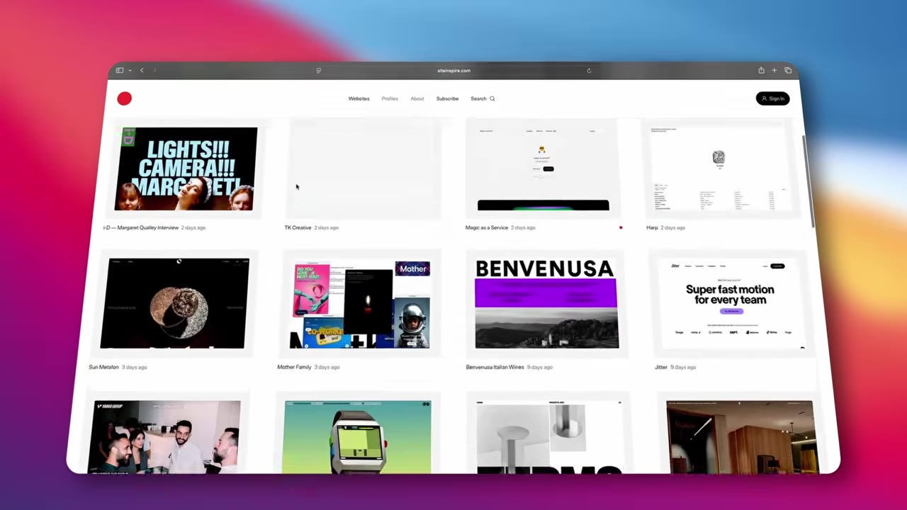
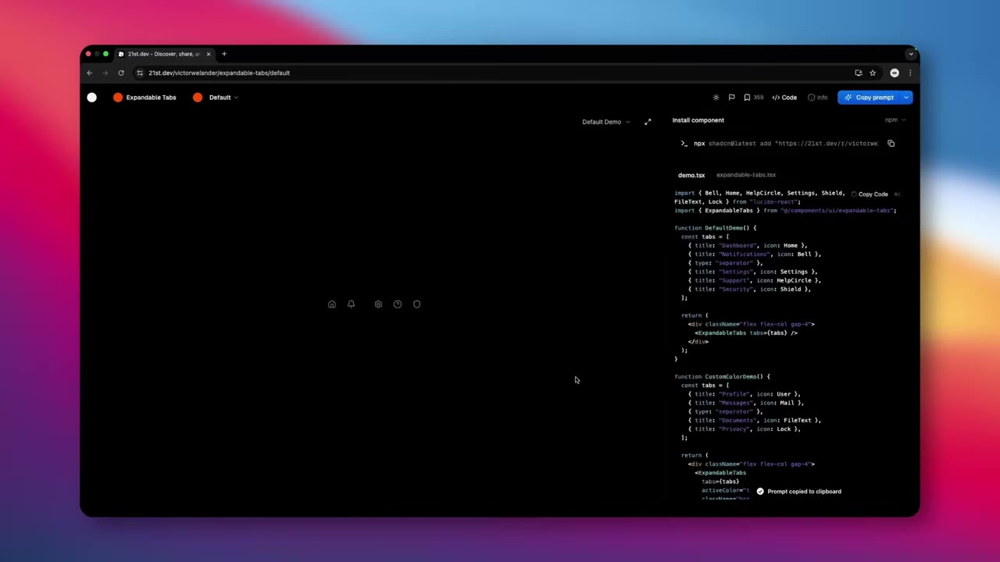
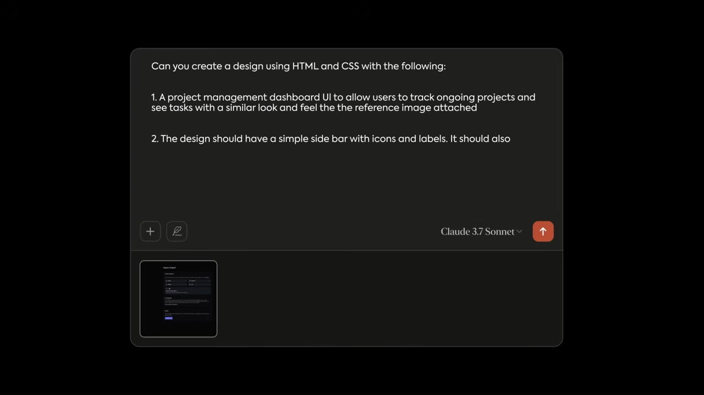
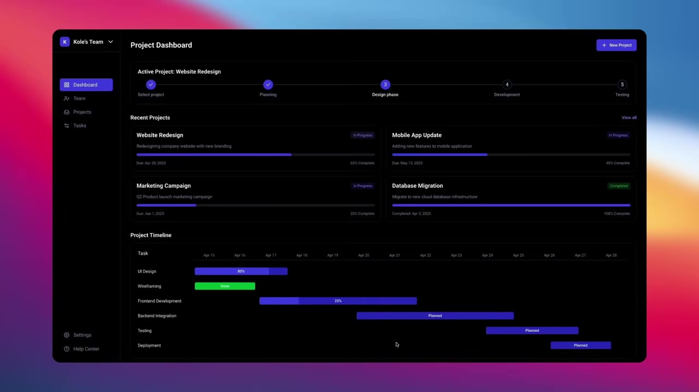
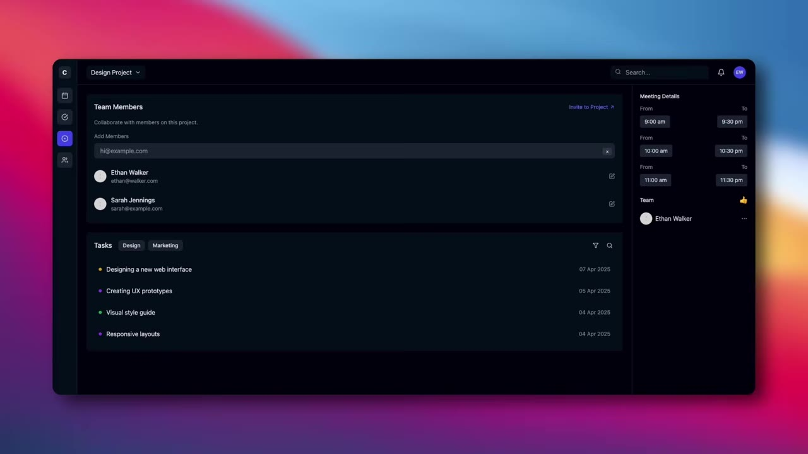
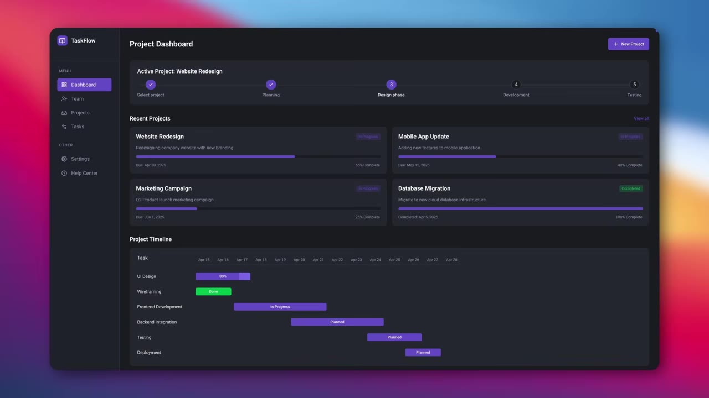

# Case study: from reference search to a refined Claude dashboard

This case study preserves the teaching sequence from [Vibe Coding a Pro UI in SECONDS With AI](https://www.youtube.com/watch?v=xHD01_Onac0). Use it as a model for narrating decisions, not as a dashboard template.

## 1. Define the job before the style

The target is a project-management dashboard where a user can see ongoing projects, tasks, progress, and a timeline. That job implies a persistent project context, scannable project status, and a time-based view. “Make a dark dashboard” would not imply any of those things.

## 2. Search and reject references



The dense inspiration gallery is attractive, but the examples carry many tiny charts, labels, and decorative details. The model may catch “dark dashboard” while missing the visual logic. This is a poor primary structural reference when small details are important.



The search moves toward realistic sites and then to a shipped project-management product. The thought process is:

| Candidate | Borrow | Reject | Decision |
|---|---|---|---|
| Dense gallery shot | atmosphere, possible palette | tiny details and presentation-only composition | visual direction only |
| Realistic site gallery | plausible hierarchy and spacing | examples may not match the product task | shortlist |
| Shipped project tool | app shell, density, project context | brand-specific details | primary structural reference |

In Mobbin, the equivalent search would start with `project management`, then narrow to `project overview`, `task progress`, `timeline`, and `sidebar account switcher`. Save one reference per question rather than twenty references for “vibe.”

## 3. Source a component only for a defined need



The component source is useful because it packages a specific interaction. It is not used to decide the whole product hierarchy. Before reusing it, check framework compatibility, keyboard behavior, responsive states, dependencies, and whether the interaction belongs in the product.

## 4. Turn intent into a prompt contract



The source prompt improves as it adds four layers:

1. explicit design request and HTML/CSS output;
2. project-management purpose and user outcome;
3. required regions such as the sidebar and Gantt chart;
4. one interface icon library instead of emoji.

An improved, implementation-aware version is:

```text
Design and implement a responsive project dashboard in semantic HTML and CSS.

The user must be able to identify the active project, scan four recent projects,
compare completion, and understand the next two weeks of scheduled work.

Include:
- sidebar with account switcher, primary navigation, and bottom utilities;
- active-project stepper with completed/current/upcoming semantics;
- project rows with owner, due date, and numeric completion;
- accessible timeline whose color is not the only status signal;
- empty, loading, and error examples.

Use the attached reference only for dark surface hierarchy and compact density.
Do not copy its information architecture. Use Lucide icons; no emoji or gradients.
Reuse the project's tokens. At 768px collapse the sidebar without hiding account access.

Acceptance: no horizontal overflow at 390/768/1440px; keyboard-visible focus;
status meaning survives grayscale; all progress labels match their values.
```

## 5. Compare outputs against the same job



This output keeps the main job visible: project status, recent projects, and timeline coexist in one hierarchy.



The denser reference does not produce more fidelity. The model drops or rearranges details and turns the page into a different workflow about members, tasks, and meetings. This is why comparison must ask “does it support the stated job?” rather than “does it look polished?”

## 6. Preserve the generated draft


Observable problems in the draft:

- `MENU` and `OTHER` consume attention without helping navigation;
- account identity is absent from the sidebar;
- mixed alignment weakens the scan line;
- purple is used for both brand emphasis and several statuses;
- “In Progress” appears where a measured percentage would be more useful;
- the cool gray surface and purple accent do not yet form a deliberate product palette.

The intended job is not to “look cleaner.” It is to scan project state quickly and trust that labels and colors mean the same thing everywhere.

## 7. Intervene in causal order

| Observation | Change | Why | Verify |
|---|---|---|---|
| No active-user context | add name, avatar, and switch affordance | shows which workspace/account is active | user can locate and switch account |
| Sidebar has weak scan line | align icons/labels; tighten group spacing; demote utilities | repeated x-positions reduce visual search | scan labels vertically without zig-zag |
| Category labels add little | remove `MENU`/`OTHER` | grouping is already conveyed by spacing and position | groups remain understandable |
| Palette feels inherited | tune surface first, then accent and text contrast | foreground colors are perceived relative to the surface | compact labels pass contrast checks |
| Status color is inconsistent | map each status to one semantic token and add text | avoids contradictory meaning | same state looks and reads the same everywhere |
| “In Progress” is vague | show a measured percentage when available | communicates degree, not merely category | label agrees with bar length and data |

## 8. Capture the after-state at the same scope



The after-state is stronger because navigation is easier to scan, account context exists, status treatment is more coherent, and progress carries more information. It is still a design hypothesis until responsive behavior, focus order, data edge cases, and contrast are tested in the working interface.

## Transferable lesson

Reference quality changes what the model understands. Prompt specificity changes what it attempts. Manual refinement changes what the product communicates. Preserve screenshots at each boundary so those three effects do not get blurred into a magical “AI made it better” story.
