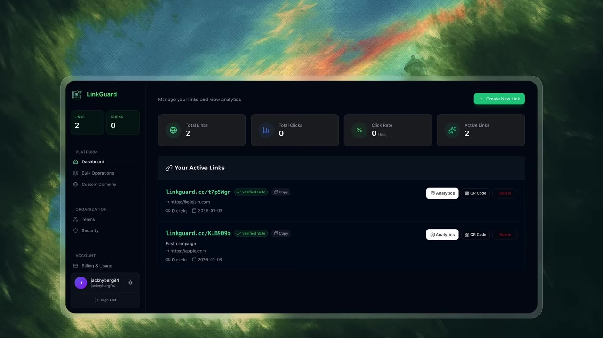
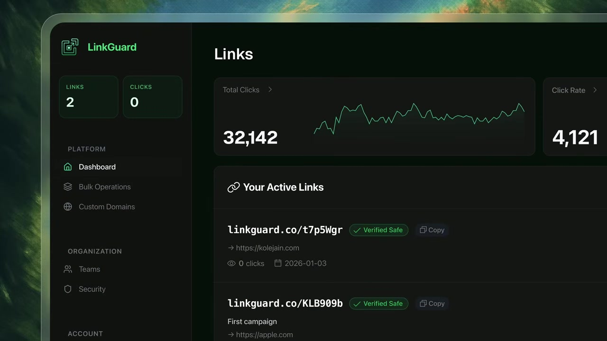
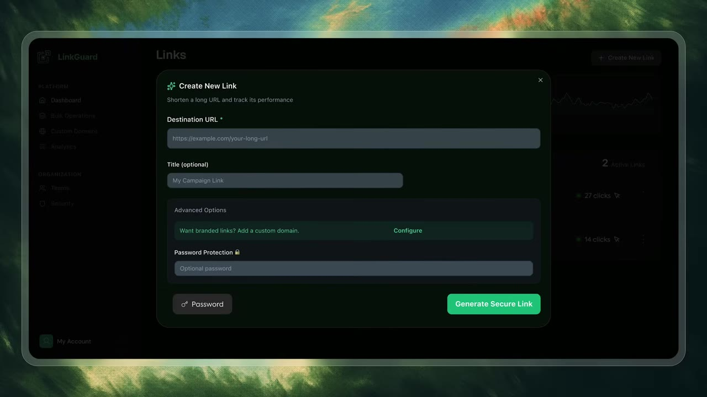
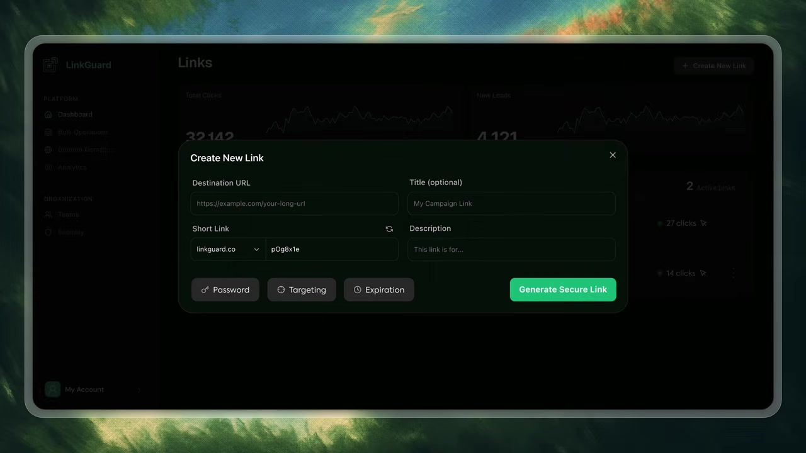

# Case study: rescue a vibe-coded SaaS

This case study follows the redesign in [5 SaaS UI/UX mistakes that SCREAM you Vibe Code](https://www.youtube.com/watch?v=PDcQJOPby1k). It demonstrates how to diagnose a working but weak product screen without reducing the critique to taste.

## Dashboard: make the data do the visual work



Screen job: a link owner should see performance direction, identify active links, and reach link actions.

What is wrong:

- four KPI tiles expose levels but not trends;
- colored icons and buttons spend salience on decoration and controls rather than data;
- link/click counts are duplicated in the sidebar and the main surface;
- every row exposes several actions, multiplying noise across the list;
- the gradient avatar and expanded account destinations look generated rather than product-specific.

The redesign hypothesis is not “remove things.” It is: use the same area to answer more useful questions, and demote capabilities that do not need permanent emphasis.



The after-state moves color into sparklines, expands charts enough to be legible, creates stable row columns, and moves secondary actions into overflow. It also adds an Analytics destination because the product now exposes analysis as a distinct job.

| Before evidence | Intervention | Reason | What must be verified |
|---|---|---|---|
| KPI is a number plus ornament | number plus time series | level and direction become visible | chart is based on real history, not decorative data |
| same counts in sidebar and content | counts live on analysis surface | navigation stays navigational | action-driving badges are not removed |
| three persistent row buttons | overflow for secondary actions | repeated controls stop dominating | primary action remains one click away |
| arbitrary blue/purple/green | surface-first palette, semantic green | fewer unrelated accents | contrast and status meaning hold in all themes |

## Create flow: let content choose the container



The form is no longer a sparse side flyout, but it still wastes vertical space and makes advanced options compete with the core task. The core job is short: destination, optional title, and a generated short link. Password, targeting, and expiration are conditional.



The second intervention uses horizontal space for related fields and turns advanced capabilities into compact secondary controls. This works only if those controls reveal clear fields, preserve keyboard focus, and remain understandable without relying on icons alone.

Use this container test:

```text
short + self-contained + no need to inspect page behind → modal
long or multi-step + page context still matters            → side panel
primary page workflow + shareable/recoverable state         → dedicated route
```

## The repeatable rescue sequence

1. Capture one representative state before editing.
2. Write the screen job and top three user questions.
3. Mark duplicated, missing, misleading, and merely decorative elements.
4. Search one precedent for each problem, not one inspiration board for the whole screen.
5. Change structure before styling.
6. Keep AI-generated logic that is sound; replace layout decisions that do not reflect product priority.
7. Render the same state and viewport after each structural intervention.
8. Reject an “after” that is cleaner but answers fewer questions.

## Additional checks from the full redesign

- Group settings, billing, and usage under one settings area when none is a primary navigation job.
- Remove cards that neither inform nor act.
- Explain discounts directly when plan prices otherwise appear contradictory.
- Reduce plan count when adjacent plans do not have a legible difference.
- On analytics screens, add comparison controls and useful dimensions before replacing chart decoration.
- On landing pages, use edited product views to demonstrate capability; generic feature icons cannot establish the same trust.
