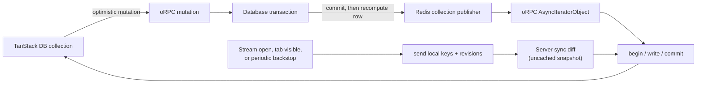

# Query Collection live sync and server cache API

**Status:** Proposed

**Tracking:** `od-scj`, `od-cfa`, `od-uja`

**Revised:** 2026-08-05, after validating Query Collection `1.0.46` direct
writes against the installed source and current TanStack DB documentation.

**Reference implementation:** [Conar/Tamery collection sync](https://github.com/wannabespace/conar/blob/7bb1b88a8bb9822188e2f548f998505f07a2dce0/apps/app/src/lib/sync.ts)

**oRPC v2 review:** [`v2.0.0-beta.25`](https://github.com/middleapi/orpc/releases/tag/v2.0.0-beta.25),
[`@orpc/publisher`](https://github.com/middleapi/orpc/blob/v2.0.0-beta.25/apps/content/docs/helpers/publisher.md),
[`BunRedisPublisher`](https://github.com/middleapi/orpc/blob/v2.0.0-beta.25/packages/bun/src/redis-publisher.ts),
the [publisher buffer implementation](https://github.com/middleapi/orpc/blob/v2.0.0-beta.25/packages/publisher/src/publisher.ts),
and the [v1 to v2 migration guide](https://github.com/middleapi/orpc/blob/v2.0.0-beta.25/apps/content/docs/migrations/from-v1.md)

## Decision

Use the current Query Collection as the first implementation. Do not build the
custom Conar-style collection adapter yet.

Query Collection `1.0.46` already exposes the API needed for pushed rows:

```typescript
collection.utils.writeUpsert(row);
collection.utils.writeDelete(key);
```

Those methods write into the authoritative synced store, update the backing
TanStack Query cache, and update every TanStack DB live query without a refetch.
Mutation handlers return `{ refetch: false }` after applying the mutation
response or waiting for its pushed row. There is no manual
`queryClient.invalidateQueries()` in this collection path.

The Query Collection still uses an API snapshot for cold start and repair. The
event stream is the incremental delivery path, not the source of truth:

```text
snapshot API  -> initial state and reconnect/periodic repair
event stream  -> incremental rows between snapshots
mutation APIs -> durable writes and authoritative mutation responses
```

The Drizzle Redis cache remains a server-only optimization. A successful write
does two independent things after commit:

1. deletes affected server cache entries;
2. publishes authoritative TanStack DB change messages.

Cache the complete `{ snapshotRevision, rows }` envelope, never the rows alone
and never stale rows paired with a fresh revision. Invalidation is delivered by
the outbox worker, and a short TTL bounds a missed invalidation. The first
vertical slice keeps the authoritative snapshot uncached until ordering,
disconnect, and publish-failure tests pass. See
[Drizzle cache API](#drizzle-cache-api).

The client never sees a Drizzle hash or cache tag and never asks the API to bust
the server cache.

## Complete selected API

This is the complete vertical shape. The snippets deliberately include the
owner of the long-running loop; an isolated `for await` example is incomplete
because its mount and cleanup lifetime determine how many streams exist.

### 0. Fully inlined resource fetch and cache identity

This is one resource-collection snapshot request from browser to Redis and
Postgres. It distinguishes inputs the browser sends from security and scope
inputs the server derives.

#### Browser-visible input

```typescript
export const resourceSnapshotInputSchema = z.object({
  projectId: projectIdField,
  environmentId: environmentIdField,
});

export type ResourceSnapshotInput = z.infer<
  typeof resourceSnapshotInputSchema
>;
```

The collection calls it with exactly two public values:

```typescript
const input: ResourceSnapshotInput = {
  projectId: "prj_01EXAMPLE" as ProjectId,
  environmentId: "env_01EXAMPLE" as EnvironmentId,
};

const snapshot = await orpc.resourceSync.snapshot.call(input, { signal });
```

The public input deliberately excludes `organizationId`, `isMain`, the Redis
key, and the cache tag. The server derives those values after authentication.

| Value | Source | Why it affects the result |
|---|---|---|
| `projectId` | Browser input | Selects one project |
| `environmentId` | Browser input | Selects one environment |
| `organizationId` | `context.activeOrganizationId` | Authorization boundary; prevents cross-organization cache reuse |
| `isMain` | Project row + `environmentId` | Main includes legacy `environment_id IS NULL` rows; non-main does not |
| `projectionVersion` | Server constant (`v1`) | Separates incompatible response shapes |
| `visibilityFingerprint` | Server policy, only if needed | Required if two authorized actors can see different rows in the same scope |

Today organization members receive the same public resource projection after
project authorization, so no actor ID belongs in the key. If field or row
visibility becomes role-dependent, add a stable visibility fingerprint; never
cache an actor-filtered response under an organization-uniform key.

#### Canonical endpoint key

Use a positional tuple instead of serializing an arbitrary object. Tuple order
is fixed and cannot change because somebody reordered object properties.

```typescript
interface AuthorizedResourceSnapshotScope {
  organizationId: OrganizationId;
  projectId: ProjectId;
  environmentId: EnvironmentId;
  isMain: boolean;
}

interface ResourceSnapshotCacheIdentity {
  canonical: string;
  hash: string;
  dataKey: string;
}

async function sha256Hex(value: string): Promise<string> {
  const bytes = new TextEncoder().encode(value);
  const digest = await crypto.subtle.digest("SHA-256", bytes);

  return [...new Uint8Array(digest)]
    .map((byte) => byte.toString(16).padStart(2, "0"))
    .join("");
}

export async function resourceSnapshotCacheIdentity(
  scope: AuthorizedResourceSnapshotScope,
): Promise<ResourceSnapshotCacheIdentity> {
  const canonical = JSON.stringify([
    "resource-snapshot",
    "v1",
    scope.organizationId,
    scope.projectId,
    scope.environmentId,
    scope.isMain,
  ]);
  const hash = await sha256Hex(canonical);

  return {
    canonical,
    hash,
    dataKey: `api:cache:resource-snapshot:${hash}`,
  };
}
```

For the example scope:

```text
canonical:
["resource-snapshot","v1","org_01EXAMPLE","prj_01EXAMPLE","env_01EXAMPLE",true]

SHA-256:
7bc97d1ba6a5ff9be37ef8103c073dbab5e01993e67ffde202fb8bdcc3057c21

Redis key:
api:cache:resource-snapshot:7bc97d1ba6a5ff9be37ef8103c073dbab5e01993e67ffde202fb8bdcc3057c21
```

The new snapshot contract requires `environmentId`. The existing
`project.resource.list` contract may still omit it for compatibility; that
handler resolves omission to the project's main environment before delegating
to the snapshot loader. Cache identity always receives the resolved effective
scope, never `undefined`.

#### Inlined oRPC handler

```typescript
const RESOURCE_SNAPSHOT_TTL_SECONDS = 10;

export const snapshot = orgScopedProcedure.resourceSync.snapshot.handler(
  async ({ input, context, errors }) => {
    // 1. Organization comes from the authenticated session, not the request.
    const organizationId = context.activeOrganizationId;

    // 2. This query is also the authorization check. A project from another
    // organization behaves as NOT_FOUND and can never reach cache lookup.
    const project = await getProjectInOrg({
      projectId: input.projectId,
      organizationId,
    });
    if (!project) throw errors.NOT_FOUND();

    // 3. Resolve the effective scope before hashing it. `isMain` changes SQL
    // membership because main also owns legacy NULL-environment rows.
    const environment = resolveEnvironmentScope(project, input.environmentId);
    if (!environment) {
      return {
        snapshotRevision: "0",
        rows: [],
      } satisfies ResourceSnapshot;
    }

    const scope: AuthorizedResourceSnapshotScope = {
      organizationId,
      projectId: input.projectId,
      environmentId: environment.environmentId,
      isMain: environment.isMain,
    };

    // 4. Exactly the same scope function is used by reads and invalidation.
    const identity = await resourceSnapshotCacheIdentity(scope);

    // 5. Endpoint-level Redis lookup. Parse through the output schema so a
    // stale deployment or corrupted entry degrades to a miss.
    const cacheRead = await Result.tryPromise(() => redis.get(identity.dataKey));
    if (!cacheRead.isErr() && cacheRead.value !== null) {
      try {
        const decoded = JSON.parse(cacheRead.value, reviveRichValues);
        const parsed = resourceSnapshotSchema.safeParse(decoded);
        if (parsed.success) return parsed.data;
      } catch {
        // Corrupt or old-schema value: continue as a cache miss.
      }
    }

    // 6. Cache miss: one consistent Postgres snapshot. All SQL inside this
    // function bypasses Drizzle's global per-query cache; otherwise a fresh
    // endpoint entry could be assembled from stale nested query entries.
    const snapshot = await db.transaction(async (tx) => {
      await tx.execute(sql`set transaction isolation level repeatable read`);

      const snapshotRevision = await currentSyncRevision(tx, scope);
      const rows = await loadSyncedResourceRows(tx, scope, {
        drizzleCache: false,
      });

      return resourceSnapshotSchema.parse({ snapshotRevision, rows });
    });

    // 7. A cache outage never fails the API read.
    await Result.tryPromise(() =>
      redis.set(
        identity.dataKey,
        JSON.stringify(snapshot, tagRichValues),
        "EX",
        RESOURCE_SNAPSHOT_TTL_SECONDS,
      ),
    );

    return snapshot;
  },
);
```

Export `tagRichValues`/`reviveRichValues` from the existing Drizzle Redis cache
module and reuse them rather than copying them. The production cache utility
also records Redis and JSON failures through the application logger.

#### What Drizzle hashes automatically

The repository configures `redisCache({ global: true, ttl: 60 })`, so every
ordinary Drizzle select is cached unless it calls `$withCache(false)`. Drizzle
`1.0.0-rc.4-5d5b77c` computes its key as follows:

```typescript
async function hashQuery(sql: string, params: unknown[]): Promise<string> {
  const dataToHash = `${sql}-${JSON.stringify(
    params,
    (_key, value) => (typeof value === "bigint" ? `${value}n` : value),
  )}`;

  return sha256Hex(dataToHash);
}
```

The local `RedisCache` then adds `drizzle:cache:`:

```text
drizzle:cache:<SHA-256(SQL + serialized bound parameters)>
```

For `projectId = prj_01EXAMPLE`, main environment
`env_01EXAMPLE`, the current resource list performs at least these three base
queries and therefore creates three different keys:

| Query | Bound parameters | Drizzle hash |
|---|---|---|
| `resource JOIN database_resource` | `prj_01EXAMPLE`, `env_01EXAMPLE` | `2a5fa214a9b593955d1330e8942654c593762adc8c754e8eb9db64b0fa6dfa17` |
| `resource JOIN service_resource` | `prj_01EXAMPLE`, `env_01EXAMPLE` | `44c860e492ad427c806ce41a1689fd0bda909a896a1607797f13bc991de71fad` |
| `resource JOIN compose_resource` | `prj_01EXAMPLE`, `env_01EXAMPLE` | `3afea9722544722fba15f3646652c913ef9c3f0664f94876573bf2c1a7106be8` |

Each query also runs derived reads for latest deployments, service environment
variables, and runtime state. Consequently, a Drizzle SQL hash is a unique
database-query identity, not a unique `project.resource.list` endpoint
identity.

If a query uses an explicit Drizzle tag:

```typescript
query.$withCache({
  tag: "resources:v1:prj_01EXAMPLE:env_01EXAMPLE:services",
  config: { ex: 10 },
});
```

Drizzle skips `hashQuery` and the local cache stores it at:

```text
drizzle:cache:tag:resources:v1:prj_01EXAMPLE:env_01EXAMPLE:services
```

An explicit tag is the cache key, not merely an invalidation label. Therefore
the database, service, and compose selects must never share one tag: each put
would overwrite the previous query's differently shaped result. This is
another reason the complete snapshot needs its own endpoint-level cache entry.

#### Which cache layer to use

For normal CRUD queries, keep Drizzle's automatic SQL cache:

```text
SQL + bound params -> Drizzle SHA-256 -> drizzle:cache:<hash>
```

For the resource synchronization snapshot, use the endpoint-level identity:

```text
authorized effective scope -> canonical tuple -> SHA-256
                           -> api:cache:resource-snapshot:<hash>
```

Do not stack both caches for the same snapshot computation. The snapshot loader
uses `$withCache(false)` on every underlying Drizzle query, then caches the
validated `{ snapshotRevision, rows }` envelope once.

#### Exact invalidation

The mutation transaction stores the authorized cache scope in the outbox next
to the public event. The worker recomputes the same key and deletes it before
publishing:

```typescript
interface ResourceSyncOutboxScope {
  organizationId: OrganizationId;
  projectId: ProjectId;
  environmentId: EnvironmentId;
  isMain: boolean;
}

export async function invalidateResourceSnapshot(
  scope: ResourceSyncOutboxScope,
): Promise<void> {
  const identity = await resourceSnapshotCacheIdentity(scope);
  await Result.tryPromise(() => redis.del(identity.dataKey));
}

for (const item of await claimResourceSyncOutboxBatch()) {
  await invalidateResourceSnapshot(item.cacheScope);
  await resourcesPublisher.publish(item.streamKey, item.event);
  await markSyncOutboxDelivered(item.id);
}
```

The important equality is:

```text
read effective scope == mutation outbox cacheScope
```

Both pass through `resourceSnapshotCacheIdentity`. No caller manually
concatenates a Redis key, and the browser never receives the key.

### 1. Shared row, snapshot, and event types

The snapshot row and the event row are the same public projection. `revision`
is a decimal string produced by a transactionally locked, scope-local counter;
it is never a timestamp or content hash. A plain Postgres sequence is not safe
for the snapshot floor because sequence allocation order is not commit order.

```typescript
import * as z from "zod";

import { resourceSchema } from "./resource-schemas";
import { projectIdField, resourceIdField } from "./shared";

export const syncRevisionSchema = z.string().regex(/^\d+$/);

export const syncedResourceSchema = z.intersection(
  resourceSchema,
  z.object({ syncRevision: syncRevisionSchema }),
);

export type SyncedResource = z.infer<typeof syncedResourceSchema>;

export const resourceSnapshotSchema = z.object({
  /** Snapshot-wide floor read in the same DB transaction as `rows`. */
  snapshotRevision: syncRevisionSchema,
  rows: z.array(syncedResourceSchema),
});

export type ResourceSnapshot = z.infer<typeof resourceSnapshotSchema>;

export const resourceSyncEventSchema = z.discriminatedUnion("action", [
  z.object({
    kind: z.literal("resource-row"),
    action: z.literal("upsert"),
    projectId: projectIdField,
    environmentId: environmentIdField,
    row: syncedResourceSchema,
  }),
  z.object({
    kind: z.literal("resource-row"),
    action: z.literal("delete"),
    projectId: projectIdField,
    environmentId: environmentIdField,
    resourceId: resourceIdField,
    revision: syncRevisionSchema,
  }),
]);

export type ResourceSyncEvent = z.infer<typeof resourceSyncEventSchema>;
```

Every existing row carries its revision. Deletes carry a revision because no
row remains. The snapshot also carries a global floor. After a snapshot at
revision `500`, buffered events at revisions `<= 500` are obsolete, including
an old insert for a row that is now deleted.

### 2. oRPC contracts

Keep the existing one-shot `resource.list` response for callers that need it.
Add a snapshot endpoint for the collection so changing its response envelope
does not break the CLI or other clients.

```typescript
import { asyncIteratorObject, oc } from "@orpc/contract";
import * as z from "zod";

const resourceScopeSchema = z.object({
  projectId: projectIdField,
  environmentId: environmentIdField,
});

export const resourceSyncContract = {
  snapshot: oc
    .route({
      method: "GET",
      path: "/projects/{projectId}/environments/{environmentId}/resources/snapshot",
    })
    .input(resourceScopeSchema)
    .output(resourceSnapshotSchema),

  events: oc
    .route({
      method: "GET",
      path: "/projects/{projectId}/environments/{environmentId}/resources/events",
    })
    .input(resourceScopeSchema)
    .output(asyncIteratorObject(resourceSyncEventSchema)),
};
```

The browser sends typed scope fields. It never supplies a Redis channel.
Authentication and authorization run before the server derives the channel.

### 3. Canonical identity

```typescript
interface ResourceCollectionScope {
  projectId: ProjectId;
  environmentId: EnvironmentId;
}

function resourceCollectionIdentity(scope: ResourceCollectionScope) {
  const scopeKey = `${scope.projectId}:${scope.environmentId}`;

  return {
    collectionId: `resources:v1:${scopeKey}`,
    queryKey: ["resource-snapshot", "v1", scope.projectId, scope.environmentId] as const,
    publisherPrefix: "sync:v1:resources:",
    streamKey: scopeKey,
  };
}
```

The full Redis publisher topic is `publisherPrefix + streamKey`. The browser
uses `collectionId`, `queryKey`, and typed scope. The endpoint cache key is
derived separately from the fully authorized scope by
`resourceSnapshotCacheIdentity` above.

### 4. Publisher and outbox worker

One publisher exists for the resource collection type. The authorized scope is
the event name inside that namespace.

```typescript
import { BunRedisPublisher } from "@orpc/bun";

import { createRedis } from "../../lib/redis";

type ResourcePublisherEvents = Record<string, ResourceSyncEvent>;

export const resourcesPublisher = new BunRedisPublisher<ResourcePublisherEvents>(
  createRedis(),
  {
    subscriber: createRedis(),
    prefix: "sync:v1:resources:",
  },
);
```

The mutation transaction writes an outbox row; it never publishes directly.
A worker claims committed outbox rows, invalidates the exact snapshot cache,
publishes, and then marks the outbox row delivered.

```typescript
export async function deliverResourceSyncOutbox(): Promise<void> {
  for (const item of await claimResourceSyncOutboxBatch()) {
    const event = resourceSyncEventSchema.parse(item.event);
    const identity = resourceCollectionIdentity({
      projectId: event.projectId,
      environmentId: event.environmentId,
    });

    await invalidateResourceSnapshot(item.cacheScope);
    await resourcesPublisher.publish(identity.streamKey, event);
    await markSyncOutboxDelivered(item.id);
  }
}
```

`claimResourceSyncOutboxBatch` uses `FOR UPDATE SKIP LOCKED` or an equivalent
lease so multiple workers cannot deliver the same row concurrently. Duplicate
delivery remains safe because the client revision gate is idempotent.

### 5. Server snapshot handler

The rows and snapshot floor must be read in one repeatable-read transaction.
Otherwise the server can return a row state from after the floor and the client
cannot order buffered events against it.

```typescript
export const snapshot = orgScopedProcedure.resourceSync.snapshot.handler(
  async ({ input, context }) => {
    const scope = await authorizeResourceScope(input, context);

    return db.transaction(async (tx) => {
      await tx.execute(sql`set transaction isolation level repeatable read`);

      const snapshotRevision = await currentSyncRevision(tx, scope);
      const rows = await loadSyncedResourceRows(tx, scope);

      return {
        snapshotRevision,
        rows,
      } satisfies ResourceSnapshot;
    });
  },
);
```

`loadSyncedResourceRows` may use the Drizzle cache only if the cached value
contains both rows and the exact `snapshotRevision` from the transaction that
created them. A fresh floor must never be attached to stale cached rows. The
safest first slice reads this authoritative snapshot directly from Postgres and
adds caching only after the uncached protocol passes fault tests.

### 6. Server event handler

```typescript
export const events = orgScopedProcedure.resourceSync.events.handler(
  async function* ({ input, context, signal }) {
    const scope = await authorizeResourceScope(input, context);
    const { streamKey } = resourceCollectionIdentity(scope);

    for await (const event of resourcesPublisher.subscribe(streamKey, {
      signal,
      maxBufferedEvents: 200,
    })) {
      yield event;
    }
  },
);
```

oRPC v2 currently drops the oldest publisher event when its iterator buffer
overflows. The snapshot repair timer therefore remains mandatory. If overflow
must trigger immediate repair, wrap the iterator in a bounded queue that closes
on overflow; there is no `onOverflow: "close"` publisher option.

### 7. Atomic server mutation and publication

The domain write, row revision, tombstone, and outbox record belong to the same
Postgres transaction.

```typescript
export async function updateResourceAndQueueEvent(
  input: UpdateResourceInput,
): Promise<SyncedResource> {
  return db.transaction(async (tx) => {
    await updateResource(tx, input);

    const row = await computePublicResourceProjection(tx, input.resourceId);
    // Locks the sync_scope_cursor row until commit. Revisions therefore follow
    // commit order for this scope, which makes snapshotRevision a safe floor.
    const revision = await nextSyncRevision(tx, {
      collection: "resources",
      streamKey: `${row.projectId}:${row.environmentId}`,
    });
    const syncedRow = { ...row, syncRevision: revision };

    await upsertSyncRow(tx, {
      collection: "resources",
      streamKey: `${row.projectId}:${row.environmentId}`,
      rowKey: row.resourceId,
      revision,
      deletedAt: null,
    });

    await insertSyncOutbox(tx, {
      streamKey: `${row.projectId}:${row.environmentId}`,
      event: {
        kind: "resource-row",
        action: "upsert",
        projectId: row.projectId,
        environmentId: row.environmentId,
        row: syncedRow,
      } satisfies ResourceSyncEvent,
    });

    return syncedRow;
  });
}
```

The mutation endpoint returns the authoritative row to the calling browser:

```typescript
export const update = orgScopedProcedure.project.resource.update.handler(
  async ({ input, context }) => {
    await authorizeResourceMutation(input, context);
    return updateResourceAndQueueEvent(input);
  },
);
```

An outbox worker invalidates the matching cache tag and publishes the event.
Publication failure does not turn a committed mutation into an API error; the
outbox retries, and the periodic snapshot is the final repair path.

Delete uses the same transaction:

```typescript
const revision = await nextSyncRevision(tx, {
  collection: "resources",
  streamKey,
});

await deleteResource(tx, resourceId);
await writeSyncTombstone(tx, { streamKey, rowKey: resourceId, revision });
await insertSyncOutbox(tx, {
  streamKey,
  event: {
    kind: "resource-row",
    action: "delete",
    projectId,
    environmentId,
    resourceId,
    revision,
  },
});
```

Change the delete contract from `{ ok: true }` to the authoritative
acknowledgement required by the revision gate:

```typescript
const deleteResourceResultSchema = z.object({
  resourceId: resourceIdField,
  revision: syncRevisionSchema,
});
```

### 8. Scoped Query Collection definition

Use one collection per project/environment scope. This avoids direct writes to
one on-demand collection rewriting unrelated project subset caches.

```typescript
import { createCollection } from "@tanstack/db";
import {
  DeleteOperationItemNotFoundError,
  queryCollectionOptions,
} from "@tanstack/query-db-collection";

function ignoreAlreadyDeleted(error: unknown): void {
  if (!(error instanceof DeleteOperationItemNotFoundError)) throw error;
}

interface ResourceWriteTarget {
  utils: {
    writeUpsert(row: SyncedResource): void;
    writeDelete(key: ResourceId): void;
  };
}

interface ResourceRevisionGate {
  upsert(row: SyncedResource): void;
  delete(key: ResourceId, revision: string): void;
  reset(snapshot: ResourceSnapshot): void;
}

const revisionGates = new WeakMap<object, ResourceRevisionGate>();

function createResourceRevisionGate(
  collection: ResourceWriteTarget,
): ResourceRevisionGate {
  const applied = new Map<ResourceId, bigint>();
  let snapshotFloor = -1n;

  const accepts = (key: ResourceId, revision: bigint): boolean =>
    revision > snapshotFloor && (applied.get(key) ?? -1n) < revision;

  return {
    upsert(row) {
      const revision = BigInt(row.syncRevision);
      if (!accepts(row.resourceId, revision)) return;

      collection.utils.writeUpsert(row);
      applied.set(row.resourceId, revision);
    },

    delete(key, version) {
      const revision = BigInt(version);
      if (!accepts(key, revision)) return;

      try {
        collection.utils.writeDelete(key);
      } catch (error) {
        ignoreAlreadyDeleted(error);
      }
      applied.set(key, revision);
    },

    reset(snapshot) {
      snapshotFloor = BigInt(snapshot.snapshotRevision);
      applied.clear();
      for (const row of snapshot.rows) {
        applied.set(row.resourceId, BigInt(row.syncRevision));
      }
    },
  };
}

export function createResourceCollection(scope: ResourceCollectionScope) {
  const identity = resourceCollectionIdentity(scope);
  let revisionGate!: ResourceRevisionGate;

  const collection = createCollection(
    queryCollectionOptions({
      id: identity.collectionId,
      queryKey: identity.queryKey,
      queryClient,

      // The stream owner explicitly calls utils.refetch() after subscribing.
      enabled: false,

      queryFn: ({ signal }): Promise<ResourceSnapshot> =>
        orpc.resourceSync.snapshot.call(scope, { signal }),

      select: (snapshot: ResourceSnapshot): SyncedResource[] => snapshot.rows,
      getKey: (row) => row.resourceId,

      onInsert: async ({ transaction }) => {
        for (const mutation of transaction.mutations) {
          const row = await orpc.project.resource.create.call(mutation.modified);
          revisionGate.upsert(row);
        }
        return { refetch: false };
      },

      onUpdate: async ({ transaction }) => {
        for (const mutation of transaction.mutations) {
          const row = await orpc.project.resource.update.call({
            resourceId: mutation.key,
            changes: mutation.changes,
          });
          revisionGate.upsert(row);
        }
        return { refetch: false };
      },

      onDelete: async ({ transaction }) => {
        for (const mutation of transaction.mutations) {
          const deleted = await orpc.project.resource.delete.call({
            projectId: scope.projectId,
            resourceId: mutation.key,
          });
          revisionGate.delete(deleted.resourceId, deleted.revision);
        }
        return { refetch: false };
      },
    }),
  );

  revisionGate = createResourceRevisionGate(collection);
  revisionGates.set(collection, revisionGate);
  return collection;
}

export type ResourceCollection = ReturnType<typeof createResourceCollection>;

function revisionGateFor(collection: ResourceCollection): ResourceRevisionGate {
  const gate = revisionGates.get(collection);
  if (!gate) throw new Error("Resource collection has no revision gate");
  return gate;
}
```

`queryFn` and `select` are explicitly typed so the installed overload infers
`TQueryData = ResourceSnapshot` and collection row `T = SyncedResource`. The
same revision gate handles mutation responses and broadcast events; otherwise a
late event can overwrite a newer row that arrived in the mutation response.

### 9. Collection registry

The registry guarantees that every consumer of the same scope gets the same
collection and therefore the same optimistic and synced state.

```typescript
const resourceCollections = new Map<string, ResourceCollection>();

export function getResourceCollection(scope: ResourceCollectionScope) {
  const id = resourceCollectionIdentity(scope).collectionId;
  let collection = resourceCollections.get(id);

  if (!collection) {
    collection = createResourceCollection(scope);
    resourceCollections.set(id, collection);
  }

  return collection;
}

export async function destroyResourceCollection(scope: ResourceCollectionScope) {
  const id = resourceCollectionIdentity(scope).collectionId;
  const collection = resourceCollections.get(id);
  if (!collection) return;

  resourceCollections.delete(id);
  await collection.cleanup();
}
```

### 10. The event loop and its owner

This is where the `for await` loop lives. It is a scoped runtime, not a leaf
component and not the collection definition itself.

```typescript
function reportResourceSyncError(error: unknown): void {
  console.warn("[resource-sync] repair failed", error);
}

async function retryWithBackoff(
  error: unknown,
  signal: AbortSignal,
): Promise<void> {
  reportResourceSyncError(error);

  await new Promise<void>((resolve) => {
    const timer = window.setTimeout(resolve, 1_000);
    signal.addEventListener(
      "abort",
      () => {
        window.clearTimeout(timer);
        resolve();
      },
      { once: true },
    );
  });
}

interface ResourceSyncRuntime {
  stop(): void;
}

export function startResourceSync(
  scope: ResourceCollectionScope,
  collection: ResourceCollection,
): ResourceSyncRuntime {
  const controller = new AbortController();
  const { signal } = controller;
  const revisionGate = revisionGateFor(collection);

  let repairInFlight: Promise<void> | null = null;
  let buffering = true;
  let streamReady = false;
  const buffered: ResourceSyncEvent[] = [];

  const applyEvent = (event: ResourceSyncEvent): void => {
    if (event.action === "delete") {
      revisionGate.delete(event.resourceId, event.revision);
    } else {
      revisionGate.upsert(event.row);
    }
  };

  const receiveEvent = (event: ResourceSyncEvent): void => {
    if (buffering) buffered.push(event);
    else applyEvent(event);
  };

  const drainAndGoLive = (): void => {
    for (const event of buffered.splice(0)) applyEvent(event);
    // No await between the final drain and this assignment. JavaScript cannot
    // interleave another iterator callback inside these synchronous lines.
    buffering = false;
  };

  const repair = async (): Promise<void> => {
    if (repairInFlight) return repairInFlight;

    repairInFlight = (async () => {
      // Every repair, not only cold start, buffers the stream. Otherwise an
      // event received during refetch can be overwritten by an older snapshot.
      buffering = true;

      try {
        await collection.utils.refetch({ throwOnError: true });

        const snapshot = queryClient.getQueryData<ResourceSnapshot>(
          resourceCollectionIdentity(scope).queryKey,
        );
        if (!snapshot) throw new Error("Resource snapshot missing after refetch");

        revisionGate.reset(snapshot);
      } finally {
        // On a failed snapshot, keep the last valid floor and still apply the
        // events received meanwhile. A later repair will try the snapshot again.
        drainAndGoLive();
      }
    })().finally(() => {
      repairInFlight = null;
    });

    return repairInFlight;
  };

  void (async () => {
    while (!signal.aborted) {
      const attempt = new AbortController();
      const attemptSignal = AbortSignal.any([signal, attempt.signal]);
      let pump: Promise<void> | undefined;

      try {
        // Subscribe first. Events arriving during the snapshot are buffered.
        buffering = true;
        const stream = await orpc.resourceSync.events.call(scope, {
          signal: attemptSignal,
        });
        streamReady = true;

        pump = (async () => {
          for await (const event of stream) {
            receiveEvent(event);
          }
        })();

        await repair();
        await pump;

        // A normally-ended authoritative stream is also a reconnect signal.
        if (!attemptSignal.aborted) {
          throw new Error("Resource event stream ended");
        }
      } catch (error) {
        if (signal.aborted) return;
        await retryWithBackoff(error, signal);
      } finally {
        streamReady = false;
        buffering = true;
        attempt.abort("resource sync attempt ended");
        await pump?.catch(() => undefined);
      }
    }
  })();

  const onVisibility = () => {
    if (streamReady && document.visibilityState === "visible") {
      void repair().catch(reportResourceSyncError);
    }
  };
  document.addEventListener("visibilitychange", onVisibility);

  const timer = window.setInterval(() => {
    if (streamReady) void repair().catch(reportResourceSyncError);
  }, 2 * 60_000);

  return {
    stop() {
      document.removeEventListener("visibilitychange", onVisibility);
      window.clearInterval(timer);
      controller.abort("resource sync stopped");
    },
  };
}
```

The per-attempt controller prevents a failed snapshot from leaking its stream
into the next reconnect attempt. The collection-wide controller stops the
entire runtime.

### 11. React lifetime boundary

Mount exactly one runtime at the route boundary that owns the scope. In the
current app that is the project layout, where `useProjectEvents` already lives.

```typescript
export function useResourceSync(scope: ResourceCollectionScope | null) {
  useEffect(() => {
    if (!scope) return;

    const collection = getResourceCollection(scope);
    const runtime = startResourceSync(scope, collection);

    return () => runtime.stop();
  }, [scope?.projectId, scope?.environmentId]);
}
```

```typescript
// apps/web/src/routes/_app/$orgSlug/_shell/$projectSlug/layout.tsx
const scope = project && activeEnv.id
  ? { projectId: project.id, environmentId: activeEnv.id }
  : null;

useResourceSync(scope);
```

Do not mount this hook in resource cards, panels, or tabs. Doing so creates one
stream per component.

### 12. Component read and mutation

```typescript
const collection = getResourceCollection({
  projectId,
  environmentId,
});

const { data: resources } = useLiveQuery(
  (q) => q.from({ resource: collection }),
  [collection],
);
```

That live query makes no API request of its own. The collection snapshot and
event runtime own the network calls.

```typescript
collection.update(resourceId, (draft) => {
  draft.name = "api-v2";
});
```

This immediately updates all live queries, calls the collection's `onUpdate`,
writes the authoritative response with `writeUpsert`, and returns
`{ refetch: false }`. The broadcast event updates other clients and is a
duplicate on the calling client; the revision gate drops or harmlessly upserts
it.

### 13. Exact API traffic

Cold start:

```text
GET resourceSync.events(scope)    open long-lived stream; buffer events
GET resourceSync.snapshot(scope)  authoritative rows + snapshotRevision
                                  apply snapshot, drain buffer, go live
```

Local update:

```text
collection.update(...)            optimistic local row
PUT project.resource.update(...)  durable database transaction
response: authoritative row       direct write; no refetch
Redis/oRPC event                   other clients update; caller deduplicates
```

Remote update:

```text
Redis/oRPC event                   writeUpsert(row); no API list call
```

Repair:

```text
GET resourceSync.snapshot(scope)  reconnect, tab visible, every two minutes
```

There is no `queryClient.invalidateQueries()` anywhere in those flows.

## Native adapter research appendix

The remainder of this document records the Conar/custom-adapter investigation.
It is not the selected first implementation. Keep it as the fallback if Query
Collection cannot provide the required stream/snapshot ordering or persistence
semantics after a production spike.

## Audit corrections from the native-adapter draft

The first draft of this design was audited against the codebase. Four decisions
changed, and they are the reason several sections read differently from the
Conar reference:

1. **Stream first, then diff, then drain**, not `Promise.all([catchUp, events])`.
   The parallel form races the diff against live events and lets a stale
   snapshot overwrite fresh rows. See [Browser sync adapter](#browser-sync-adapter).
2. **Versions are monotonic revisions, not content hashes.** Three independent
   publishers recompute-and-publish non-atomically; without ordering the client
   cannot reject a stale message. See [Row versions](#row-versions).
3. **Deletes come from tombstones, not from absence in the snapshot.** This is
   what makes the cached snapshot safe. A stale snapshot missing a
   just-created row would otherwise make the diff emit a `delete` for a live
   row, and unlike a stale `update`, which the version gate now rejects, a
   delete carries a fresh tombstone revision and would win. See
   [Drizzle cache API](#drizzle-cache-api).
4. **`proxy-routes` is the first vertical slice, not `resources`.** The resource
   projection is the hardest collection in the system and already exists in a
   pushed-row form for routes. See [Recommended first vertical slice](#recommended-first-vertical-slice).

The v2 upgrade is **not** deferred. An earlier draft treated it as optional; it
is a prerequisite, and the migration checklist below is required work rather
than a future audit.

## What Conar actually does

Conar's core cloud collections use four different identities:

| Identity | Example | Purpose |
|---|---|---|
| Collection ID | `connections` | Stable TanStack DB/persistence identity |
| Stream namespace | `orpc:publisher:connections:` | Redis publisher namespace |
| Authorized stream key | `user.id` | Isolates one user's events |
| Row/version key | `${id}:${updatedAtMs}` | Confirms an exact row version arrived |

Its collection definition supplies:

```typescript
syncCollectionOptions({
  id: "connections",
  getKey: (item) => item.id,
  events: async ({ signal, write }) => {
    for await (const message of await orpc.connections.events.call({}, { signal })) {
      write(message);
    }
  },
  sync: ({ rows, signal }) => orpc.connections.sync.call(rows, { signal }),
  onInsert: /* API write */,
  onUpdate: /* API write */,
  onDelete: /* API write */,
});
```

The sync implementation runs the event stream and a catch-up diff together.
Incoming messages are committed directly to TanStack DB. React Query is not in
that path.

otterdeploy should use the same model, adapted for organization/project scopes
and derived rows.

## What otterdeploy already has

This design is not starting from nothing, and it must not quietly grow a second
bus alongside the one already carrying these facts.

`packages/api/src/routers/project/project-event-bus.ts` is a cross-process Redis
pub/sub bus keyed `project:{projectId}:events`. The builder publishes resource
status transitions to it (build-phase changes emit no docker event, so the
docker-fed stream was silent during a build); the API process subscribes and
feeds `project.events.stream`
(`packages/api/src/routers/project/contract/events.ts`).

Two properties of that bus matter here:

- **`publishRouteUpserted` already pushes a full row**, not an id, and the client
  applies it without a round trip. Its comment states the rule this design
  generalizes: a route row is a plain select, so the writer holds exactly what
  every reader would compute. Deployments deliberately do not work this way,
  because their status is derived from live docker task state per read.
- **It redacts at the publisher.** `accessPinHash` and `domainVerifyToken` are
  stripped before publish, because a pub/sub channel is a wider audience than an
  authorized HTTP response: output validation downstream would strip them from
  the response while they sat in Redis regardless. Security rule 5 below is that
  rule restated; the version input must be computed from the redacted row.

The collection publisher replaces this bus for the collections it covers. Until
a collection migrates, its events keep flowing over the existing channel. Two
buses publishing the same fact is how they drift, so each migrated collection
must delete its old publish call in the same change.

## What to take from oRPC v2

otterdeploy currently uses oRPC `1.14.x`. The v2 review was performed against
`2.0.0-beta.25`, released on 2026-08-04.

**The v2 upgrade lands before the first collection ships.** Every example in this
document is written in v2 API, and the migration is scoped as its own change.
See [The v2 upgrade](#the-v2-upgrade). It is not a hidden dependency of the sync
work; it is the first task of the sync work.

### Adopt

- Use v2's `BunRedisPublisher` instead of maintaining a custom Redis
  publisher. It works with the Bun `RedisClient` already returned by
  `packages/api/src/lib/redis.ts`.
- Enable publisher resume. The Bun adapter writes retained events to a Redis
  Stream, publishes live events through Redis Pub/Sub, assigns event IDs, and
  deduplicates events that race between backlog replay and live delivery.
  Resume is a latency optimization, not a correctness mechanism: the
  subscribe-then-diff ordering already closes the snapshot/stream gap, and
  replay is only safe because versions are monotonic. Replayed events are by
  definition older than the diff that follows them, and the client's version
  gate drops them.
- Use the v2 name `AsyncIteratorObject` and the `asyncIteratorObject(...)`
  contract schema. `eventIterator(...)` remains only as a deprecated
  compatibility alias, and the migration converts the existing 12 call sites.
- Preserve oRPC event metadata. Directly yielding a publisher payload keeps its
  generated event ID; wrapping the payload requires `getEventMeta` and
  `withEventMeta`.
- Keep the existing client retry plugin opt-in. In v2 it is named
  `RetryLinkPlugin`, and it automatically sends the latest event ID when it
  reconnects.

### Keep outside oRPC

The publisher's resume window is recovery acceleration, not the source of
truth. Keep `organization.resources.sync(...)` and the authoritative database
diff because:

- retained Redis events expire;
- database commit can succeed while post-commit publish fails;
- a process can crash between commit and publish;
- the publisher's iterator buffer defaults to 100 events and drops the oldest
  event when full;
- a newly authorized client still needs an initial snapshot.

For collection streams, the browser sync adapter must remain the owner of the
reconnect loop so every reconnect also runs a database diff. Do not hide
collection reconnects behind infinite `RetryLinkPlugin` retries unless its
retry hook also completes that diff. Infinite retry is fine for disposable
log tails; it is not sufficient recovery for authoritative collection state.

A stream break is not the only thing that requires a diff. A publish can fail,
or a process can die between commit and publish, while the client's stream stays
perfectly healthy: that client then never learns and never reconnects. Nothing
in the transport repairs it. The adapter must therefore also re-run the diff:

- on `visibilitychange` when the tab becomes visible again (cheap, covers the
  common "laptop was asleep" case, and TanStack DB applies an empty diff as a
  no-op);
- on a slow periodic timer (minutes, not seconds) as the backstop for a tab that
  stays foregrounded for hours.

Both reuse the same diff call, so this is a scheduling decision, not new
machinery.

### The v2 upgrade

The upgrade ships as its own change, merged and deployed before the first
collection endpoint exists. Sequencing it first is what keeps it from becoming
an emergency in the middle of the sync work: every item below is a
pre-existing migration cost that exists whether or not collections happen.

oRPC v2 is a prerelease and changes the RPC wire protocol. Two consequences,
both hard requirements rather than cautions:

- **The web app and server deploy as one coordinated version.** A v1 client
  cannot call a v2 server. There is no window where a stale browser tab still
  works, plan for a forced reload, not a graceful rollout.
- **The CLI is a third client.** `apps/cli` depends on `@orpc/client` and is
  installed on machines you do not deploy. Either the v2 server keeps a v1
  compatibility surface for it, or the CLI ships and users upgrade first. This
  is the item most likely to be discovered late.

The migration checklist:

- `ClientRetryPlugin` to `RetryLinkPlugin`;
- `eventIterator` to `asyncIteratorObject`;
- the split `RPCLink` `origin` and `url` options;
- the current contract `.route(...)` declarations: 53 in `packages/api/src` as
  of this revision, up from 48 when the v2 review was written, because v2 moves
  OpenAPI routes to `openapi(...)` metadata unless the compatibility extension
  is installed. Recount at migration time rather than trusting this number;
- the contract error definitions that currently carry HTTP `status` (~242
  declarations), because v2 moves status mapping to the handler's
  `errorStatusMap`;
- `OpenAPIReferencePlugin`, whose v2 replacement expects a separately
  generated OpenAPI document;
- removal of automatic middleware deduplication, especially organization and
  project authorization middleware;
- handler event-stream options and the new 15-second keep-alive default.

The route migration must include `packages/api/src/authz/procedure-trace.ts`
and `packages/api/src/__tests__/audit-read-gate.test.ts`; both currently derive
authorization/audit behavior from the declared HTTP method, so this is not
only an OpenAPI documentation change.

Sequencing v2 first buys three things the sync design would otherwise have to
build and then throw away: `BunRedisPublisher` instead of a hand-rolled Redis
adapter, generated event IDs and a retained stream instead of a home-grown
resume, and replay/live deduplication instead of a second dedupe path in the
browser. That is the case for doing it first rather than alongside.

The one thing it does not buy is correctness. The authoritative diff, the
monotonic versions, and the version gate in `apply()` are all still required.
V2 makes the transport better, not the state machine simpler.

Typed v2 metadata plugins could later label cacheable read procedures, but
they should not replace the scope-aware Drizzle cache helpers in this design.
Keeping cache tags next to the database projection makes authorization and
invalidation inputs explicit.

## Architecture



There are two consistency paths:

- **Live path:** mutation or background process publishes row changes.
- **Recovery path:** the client sends local keys/revisions and receives a diff.

The recovery path runs on every stream open, but it is not only a reconnect
mechanism: see [Keep outside oRPC](#keep-outside-orpc) for why a healthy stream
still needs periodic diffs.

## Proposed package layout

```text
packages/shared/src/sync/
  contract.ts          SyncMessage, SyncRowVersion, typed wire schemas
  collections.ts       Collection name and scope schemas

packages/db/src/
  cache.ts             Existing server-only Drizzle Redis cache

packages/api/src/sync/
  publisher.ts         Publisher interface + v1 Redis adapter (v2: BunRedisPublisher)
  diff.ts              Catch-up diff helpers
  snapshot.ts          Uncached authoritative snapshot loaders

apps/web/src/shared/sync/
  collection-options.ts  Conar-style syncCollectionOptions
  tracker.ts             awaitChange/markSynced

apps/web/src/entities/collections/
  index.ts               Collection singleton/scoped registry
```

## Shared collection contract

### Collection scope

The collection scope determines authorization, server cache identity, and event
isolation. It is not a TanStack Query key.

```typescript
import type {
  EnvironmentId,
  OrganizationId,
  ProjectId,
  ResourceId,
} from "@otterdeploy/shared/id";

export type CollectionScope =
  | {
      collection: "resources";
      organizationId: OrganizationId;
    }
  | {
      collection: "deployments";
      organizationId: OrganizationId;
      projectId: ProjectId;
      resourceId: ResourceId;
    }
  | {
      collection: "proxy-routes";
      organizationId: OrganizationId;
      projectId: ProjectId;
    };
```

The main `resources` collection should be organization-scoped and contain all
resource rows the current organization may query. Components filter it locally
by project and environment.

**The local filter is not the obvious one.** The server's scope predicate
(`inEnvironmentScope`, `packages/api/src/routers/project/queries/resource.ts:51`)
is `or(eq(environmentId, x), isNull(environmentId))` when the environment is the
project's main pointer. Main additionally owns every unstamped row, which
predate environments. A naive `eq(resource.environmentId, environmentId)` would
silently hide those rows on main. The list query also excludes preview-scoped
rows (`isNull(resource.previewId)`).

Both rules have to be encoded in the row rather than reimplemented per call
site, or the two implementations will drift and the drift will look like missing
resources:

```typescript
// Server projects the answer once, into the row.
// `visibleEnvironmentId` is the row's environment, or the project's main
// environment when the row is unstamped. Preview rows are not projected at all.
useLiveQuery((q) =>
  q
    .from({ resource: resourcesCollection })
    .where(({ resource }) =>
      and(
        eq(resource.projectId, projectId),
        eq(resource.visibleEnvironmentId, environmentId),
      ),
    ),
);
```

This is the Conar model: one normalized collection, many live queries. There is
no collection or request cache per screen.

### Organization scope assumes organization-uniform visibility

`streamKey = organizationId` is only sound if every actor authorized for the
organization may see every row in it. That is currently false. API keys carry
`projectScope: "selected"` (`packages/api/src/authz/api-key-scope.ts`, enforced
by `packages/api/src/authz/project-scope-guards.ts`), so a project-scoped key
calling an organization-wide `events`/`sync` endpoint would receive every
project in the organization.

Two actors with different visibility cannot share a stream. Pick one:

- **Reject narrowed actors on collection endpoints.** `events` and `sync` accept
  session actors and full-org keys only; a `projectScope: "selected"` key gets
  `FORBIDDEN` and keeps using the existing project-scoped read endpoints. This
  is the first-slice choice. It is one guard, and the web app is unaffected.
- **Fold visibility into the stream key.** Only if a narrowed actor genuinely
  needs a collection later. The key then derives from the authorized project
  set, not the organization, and the snapshot filters identically.

What must never happen is deriving `streamKey` from the organization while
authorizing on something narrower.

Large or unbounded data should use a scoped collection registry. Deployment
history is a good example:

```typescript
const collection = getDeploymentsCollection({
  organizationId,
  projectId,
  resourceId,
});
```

The registry returns the same collection instance whenever the same canonical
scope is requested.

### Canonical scope identity

```typescript
export interface CollectionIdentity {
  /** Stable TanStack DB/persistence identity. */
  collectionId: string;

  /** Redis publisher namespace. */
  publisherPrefix: string;

  /** Authorized key within the publisher namespace. */
  streamKey: string;

  /** Server-only Drizzle cache tag for the collection snapshot. */
  cacheTag: string;
}

export function collectionIdentity(scope: CollectionScope): CollectionIdentity {
  const version = "v1";

  switch (scope.collection) {
    case "resources":
      return {
        collectionId: `resources:${version}:${scope.organizationId}`,
        publisherPrefix: `sync:${version}:resources:`,
        streamKey: scope.organizationId,
        cacheTag: `sync:${version}:resources:${scope.organizationId}`,
      };

    case "deployments": {
      const key = `${scope.organizationId}:${scope.projectId}:${scope.resourceId}`;
      return {
        collectionId: `deployments:${version}:${key}`,
        publisherPrefix: `sync:${version}:deployments:`,
        streamKey: key,
        cacheTag: `sync:${version}:deployments:${key}`,
      };
    }

    case "proxy-routes": {
      const key = `${scope.organizationId}:${scope.projectId}`;
      return {
        collectionId: `proxy-routes:${version}:${key}`,
        publisherPrefix: `sync:${version}:proxy-routes:`,
        streamKey: key,
        cacheTag: `sync:${version}:proxy-routes:${key}`,
      };
    }
  }
}
```

`cacheTag` is derived from the same scope as `streamKey`, on purpose: the thing
that is invalidated and the thing that is published to are the same thing, so a
publish path that forgets to invalidate is a visible asymmetry at the call site
rather than a silent one.

The browser may know `collectionId` and the typed scope. Only the server creates
and uses Redis channels and Drizzle cache tags.

Do not conflate the subscription key with the oRPC event ID:

- `publisherPrefix + streamKey` selects the authorized collection stream;
- the Redis Stream ID generated by `BunRedisPublisher` is only a resume cursor;
- the row key identifies one TanStack DB record;
- the row version acknowledges the exact record version.

The client supplies typed scope input, never a raw Redis channel. The server
authorizes that scope and derives `streamKey` itself.

## Sync message API

### Wire messages

```typescript
export type SyncMessage<T> =
  | {
      type: "insert";
      value: T;
      version: string;
    }
  | {
      type: "update";
      value: T;
      version: string;
    }
  | {
      type: "delete";
      key: string;
      version: string;
    };

export interface SyncRowVersion {
  key: string;
  version: string;
}
```

`insert` and `update` carry the complete collection row, not a patch. That makes
replayed messages idempotent and prevents a missed intermediate event from
leaving half-updated client state.

### Row versions

**A version must be monotonic, not just distinct.** The first draft used a
SHA-256 content hash. A hash answers "did this change?" but not "is this newer?",
and this system has three independent publishers for the same row, the API
mutation path, the builder, and the docker event worker. None of them publishes
atomically: each recomputes the projection and then publishes. Two concurrent
changes can therefore publish in the reverse order they were computed, and with
hash versions the client has no way to reject the older one. Replayed events
from a resume window have the same problem.

For a plain database-backed collection (proxy routes, and most rows) the row's
own `updatedAt` is a valid monotonic version:

```typescript
const version = row.updatedAt.toISOString();
```

For a derived row such as the resource projection, `updatedAt` is not enough:
deployment and docker state change without touching the base resource row. A
pure revision counter is not enough either, for the mirror-image reason, the
projection can change with no write to bump it.

Use both, with the hash as the change detector and the revision as the order:

```typescript
// One row per synced row, maintained by the server. Derived index, not truth.
sync_row(collection, stream_key, row_key, revision bigint, content_hash text,
         deleted_at timestamptz null)
```

Whenever the server computes a public row (on publish *and* on snapshot) it
hashes the redacted row and compares it to `content_hash`. If it differs, it
takes the next value from a dedicated sequence and stores both. `version` on the
wire is that `revision`, decimal-encoded, compared numerically by the client.

This gives four things at once: monotonic ordering, a version that changes when
derived state changes, a durable home for delete tombstones, and a diff that
reads revisions instead of rehashing every row on every reconnect.

Do not include secrets or actor-specific fields in the hashed representation.
`publishRouteUpserted` already sets this precedent by stripping `accessPinHash`
and `domainVerifyToken` at the publisher; the hash input is that same redacted
row, so a redaction change is also a version change.

### Delete versions

A delete carries a version from the same sequence, read from the tombstone:

```typescript
/** Write side: marks sync_row deleted and bumps `revision`, returning it.
 *  Idempotent: a repeated delete returns the existing tombstone revision
 *  rather than minting a new one, so replays stay no-ops. */
export async function deletedVersion(
  scope: CollectionScope,
  key: string,
): Promise<string>;

/** Read side, used by the diff. Returns only the keys that are genuinely
 *  tombstoned. Always reads through to Postgres, never cached, because this
 *  is exactly the question a stale cache answers wrongly. */
export async function tombstonesFor(
  scope: CollectionScope,
  keys: SyncRowVersion[],
): Promise<{ key: string; revision: string }[]>;
```

Tombstones are what make delete-then-recreate safe: the recreated row's
revision is higher than the tombstone's, so a late-arriving delete loses.
Retain them at least as long as the longest plausible client absence (the
persisted collection's staleness window), then reap, a client older than that
is rebuilt from schema version instead.

## Browser sync adapter

This is the API otterdeploy should adopt from Conar.

```typescript
import type { SyncConfig } from "@tanstack/db";

interface SyncCollectionConfig<T> {
  id: string;
  getKey: (item: T) => string;
  getVersion: (item: T) => string;

  /** Opens the stream. Resolving means the subscription is established. The
   *  adapter, not the caller, owns the read loop and the ordering. */
  subscribe(input: {
    signal: AbortSignal;
  }): Promise<AsyncIterable<SyncMessage<T>>>;

  diff(input: {
    rows: SyncRowVersion[];
    signal: AbortSignal;
  }): Promise<SyncMessage<T>[]>;

  onInsert?: CollectionMutationHandler<T>;
  onUpdate?: CollectionMutationHandler<T>;
  onDelete?: CollectionMutationHandler<T>;
}

export function syncCollectionOptions<T>(config: SyncCollectionConfig<T>) {
  const tracker = createSyncTracker();

  const sync: SyncConfig<T, string> = {
    sync: ({ begin, commit, write, collection, markReady }) => {
      const controller = new AbortController();
      const { signal } = controller;

      /** Highest revision applied per key, including tombstones. This is what
       *  makes a late or replayed message harmless instead of destructive. */
      const applied = new Map<string, bigint>();

      const apply = (messages: SyncMessage<T>[]) => {
        if (signal.aborted || messages.length === 0) return;

        const fresh = messages.filter((message) => {
          const key = message.type === "delete" ? message.key : config.getKey(message.value);
          const revision = BigInt(message.version);
          if ((applied.get(key) ?? -1n) >= revision) return false;
          applied.set(key, revision);
          return true;
        });

        if (fresh.length === 0) return;

        begin();

        for (const message of fresh) {
          if (message.type === "delete") {
            write({ type: "delete", key: message.key });
            tracker.markSynced(message.key, message.version);
          } else {
            write({ type: message.type, value: message.value });
            tracker.markSynced(config.getKey(message.value), message.version);
          }
        }

        commit();
      };

      /** Synced rows only. Optimistic rows must NOT be reported: an in-flight
       *  insert would be a key the server's snapshot has never seen, and the
       *  diff would answer `delete` for the row being created. */
      const syncedVersions = (): SyncRowVersion[] =>
        [...collection.syncedData.values()].map((row) => ({
          key: config.getKey(row),
          version: config.getVersion(row),
        }));

      const run = async () => {
        while (!signal.aborted) {
          try {
            // 1. Open the stream FIRST and buffer everything it delivers.
            const stream = await config.subscribe({ signal });
            const buffered: SyncMessage<T>[] = [];
            let live = false;

            const pump = (async () => {
              for await (const message of stream) {
                if (live) apply([message]);
                else buffered.push(message);
              }
            })();

            // 2. Now take the authoritative snapshot diff. Anything that
            //    changes while it is in flight is already in `buffered`.
            apply(await config.diff({ rows: syncedVersions(), signal }));

            // 3. Drain, then go live. No `await` between these two statements.
            //    That is what makes the handover atomic.
            apply(buffered.splice(0));
            live = true;

            markReady();
            await pump;
          } catch (error) {
            if (!signal.aborted) await retryWithBackoff(error, signal);
          }
        }
      };

      void run();

      return () => controller.abort(`${config.id} sync stopped`);
    },
  };

  return {
    id: config.id,
    getKey: config.getKey,
    sync,
    utils: { awaitChange: tracker.awaitChange },
    onInsert: config.onInsert,
    onUpdate: config.onUpdate,
    onDelete: config.onDelete,
  };
}
```

No `QueryClient` appears in this API, and that absence is the point of the
design, not an incidental detail of the snippet.

A Query Collection is fed by a `queryFn`, so keeping it current means telling
React Query that its cached answer is wrong (`invalidateQueries`) and letting it
ask again. Every push then costs a round trip, the server recomputes a whole
list to communicate one changed row, and "is this screen fresh?" is answered by
a cache policy rather than by the data. The current resource collection shows
where that lands: it polls every five seconds
(`apps/web/src/features/resources/data/resource.ts`) because some transitions
emit no event to invalidate on.

A synced collection is fed by `begin/write/commit`, so there is no cached answer
to invalidate: the row *is* the message. React Query is not being removed from
the app; it keeps one-shot reads, mutations, and everything not in a collection.
It is removed from the path that keeps collections current, and a `QueryClient`
parameter here would be the seam through which the old model returned.

### Why this order

The obvious shape: `Promise.all([catchUp(), events()])`, which is what the
first draft and the Conar reference both do. Is a race. The diff's snapshot is
taken at T0 and lands at T1; every event delivered in that window is applied
first and then overwritten by older data. It fails most often exactly when it
hurts most: on a reconnect after a deploy, when rows are changing fast.

Subscribe → buffer → diff → drain → live has no such window, and it pays for
itself twice more:

- **Resume stops being load-bearing.** `lastEventId` existed to cover the gap
  between snapshot and subscription. There is no gap, so v2's retained stream
  becomes a latency optimization the design can lose without losing
  correctness, which is the only condition under which replaying older events
  into an authoritative collection is a good idea.
- **The version gate has something to compare against.** Ordering is enforced in
  `apply()` for every path. Live, buffered, diffed, and replayed alike.

`markReady()` fires after the first diff commits, not before. Calling it early
publishes an authoritative empty collection to every live query, so a cold load
renders "no resources" before it renders the resources. A persisted collection
may mark ready as soon as it rehydrates, because it then has real rows to show;
an empty one may not.

This collection call does not set `retry: Infinity`. Doing so would let the
retry plugin reconnect internally, resuming the stream without rerunning the
authoritative diff.

### Sync tracker

`createSyncTracker` is not a bare promise map. Two requirements are easy to
miss and both produce hangs:

- **It must remember versions already seen.** The stream regularly beats the
  mutation's HTTP response: Redis is faster than the response path. If
  `awaitChange(key, version)` is called after that version already arrived, it
  must resolve immediately from a short-lived seen-set, not wait forever.
- **Every wait is bounded.** An `AbortSignal` plus a timeout, and a timeout
  resolves rather than rejects: the row is already correct in the collection by
  every other path, so a slow acknowledgement is not a failed mutation.

## Resource collection

```typescript
export function createResourcesCollection(scope: ResourcesScope) {
  const identity = collectionIdentity(scope);

  return createCollection(
    persistedCollectionOptions<ResourceRow, ResourceId, never, SyncUtils>({
      ...syncCollectionOptions<ResourceRow>({
        id: identity.collectionId,
        getKey: (row) => row.resourceId,
        getVersion: (row) => row.syncVersion,

        subscribe: ({ signal }) =>
          orpc.organization.resources.events.call(
            { organizationId: scope.organizationId },
            { signal },
          ),

        diff: ({ rows, signal }) =>
          orpc.organization.resources.sync.call(
            {
              organizationId: scope.organizationId,
              rows,
            },
            { signal },
          ),

        onInsert: async ({ transaction }) => {
          await Promise.all(
            transaction.mutations.map((mutation) =>
              orpc.project.resource.create.call(mutation.modified),
            ),
          );
        },

        onUpdate: async ({ transaction }) => {
          await Promise.all(
            transaction.mutations.map((mutation) =>
              orpc.project.resource.update.call({
                resourceId: mutation.key,
                changes: mutation.changes,
              }),
            ),
          );
        },

        onDelete: async ({ transaction }) => {
          await Promise.all(
            transaction.mutations.map((mutation) =>
              orpc.project.resource.delete.call({
                projectId: mutation.original.projectId,
                resourceId: mutation.key,
              }),
            ),
          );
        },
      }),
      persistence,
      schemaVersion: 1,
    }),
  );
}
```

The exact create/update surface will remain resource-kind-specific in real
code. This example shows where persistence handlers live, not a requirement to
introduce a universal resource mutation endpoint.

## Server oRPC API

Each synced collection exposes two read transports plus its normal mutations:

```text
organization.resources.events(scope)
  -> AsyncIteratorObject<SyncMessage<ResourceRow>>

organization.resources.sync({ scope, rows: SyncRowVersion[] })
  -> SyncMessage<ResourceRow>[]

project.resource.create/update/delete(...)
  -> existing mutation results
```

The collection endpoints live under `organization`, not `project`. An earlier
draft put an organization-scoped stream at
`orgScopedProcedure.project.resources.events`, which reads as project-scoped and
sits in a router whose every other endpoint takes a `projectId`. Note that no
organization-wide resource read exists today: `project.resource.list` is scoped
to one project and one environment (`packages/api/src/routers/project/resources.ts:120`),
so this is a genuinely new read model, not a re-export of an existing one.

The v2 contract uses the renamed streaming schema:

```typescript
import { asyncIteratorObject, oc } from "@orpc/contract";

export const resourcesEventsContract = oc
  .input(resourcesScopeSchema)
  .output(asyncIteratorObject(syncMessageSchema(resourceRowSchema)));
```

On oRPC v1 this is still written with the deprecated `eventIterator(...)`
alias. Change the name as part of the coordinated v2 migration rather than
mixing v2-only imports into the current dependency set.

### Event endpoint

```typescript
export const events = orgScopedProcedure.organization.resources.events.handler(
  async function* ({ input, context, signal }) {
    const scope = resourcesScopeFromAuthorizedInput(input, context);
    const identity = collectionIdentity(scope);

    for await (const message of resourcesPublisher.subscribe(identity.streamKey, {
      signal,
      // Bounded. Overflow ends the stream; the client's loop reopens it and
      // re-diffs, which is exactly the repair path that already exists.
      maxBufferedEvents: COLLECTION_STREAM_BUFFER,
      onOverflow: "close",
    })) {
      yield message;
    }
  },
);
```

Like Conar, the endpoint subscribes with an authenticated server-derived key.
The client cannot choose an arbitrary Redis topic. Reject actors whose
visibility is narrower than the stream. See
[Organization scope assumes organization-uniform visibility](#organization-scope-assumes-organization-uniform-visibility).

### Buffering is bounded

The first draft set `maxBufferedEvents: Number.POSITIVE_INFINITY`, reasoning
that losing a delete is worse than briefly buffering a burst. That reasoning
does not survive the diff: a dropped message is repaired by the next diff, so
dropping is safe. As long as the drop is **detectable**. Unbounded buffering,
by contrast, is per-subscriber memory that a client controls by reading slowly,
multiplied by every connected browser.

The requirement is therefore a bounded buffer whose overflow is observable, not
silent. oRPC's publisher drops the oldest event when full and says nothing, so
if the adapter cannot be configured to surface overflow, wrap `subscribe` in a
local bounded queue that aborts the iterator instead of dropping. Either way the
client sees a closed stream, reopens, and re-diffs.

Size the buffer for the slowest client you intend to serve, not the fastest,
and keep it far below what a burst of the whole collection would need, since a
burst that large is precisely the case where a diff is cheaper than a replay.

### Catch-up endpoint

```typescript
export const sync = orgScopedProcedure.organization.resources.sync.handler(
  async ({ input, context }) => {
    const scope = resourcesScopeFromAuthorizedInput(input, context);
    const currentRows = await loadResourceCollectionSnapshot(scope);

    return diffCollection({
      scope,
      local: input.rows,
      current: currentRows,
      getKey: (row) => row.resourceId,
      getVersion: (row) => row.syncVersion,
    });
  },
);
```

The diff produces:

- `insert` for current rows missing locally;
- `update` for the same key with a different version;
- `delete` for local keys with a tombstone, not merely for keys absent from
  the snapshot.

### Generic diff helper

```typescript
export async function diffCollection<T>(input: {
  scope: CollectionScope;
  local: SyncRowVersion[];
  current: T[];
  getKey: (row: T) => string;
  getVersion: (row: T) => string;
}): Promise<SyncMessage<T>[]> {
  const local = new Map(input.local.map((row) => [row.key, row.version]));
  const currentKeys = new Set<string>();
  const messages: SyncMessage<T>[] = [];

  for (const row of input.current) {
    const key = input.getKey(row);
    const version = input.getVersion(row);
    currentKeys.add(key);

    const localVersion = local.get(key);
    if (localVersion === undefined) {
      messages.push({ type: "insert", value: row, version });
    } else if (localVersion !== version) {
      messages.push({ type: "update", value: row, version });
    }
  }

  // Deletes are NOT "absent from the snapshot". They are "tombstoned in
  // sync_row". Absence is ambiguous: it can mean deleted, or it can mean the
  // snapshot was cached a moment before the row was created. Tombstones are
  // read uncached and say which. See "Why absence is not a delete".
  const missing = input.local.filter((row) => !currentKeys.has(row.key));
  for (const tombstone of await tombstonesFor(input.scope, missing)) {
    messages.push({
      type: "delete",
      key: tombstone.key,
      version: tombstone.revision,
    });
  }

  return messages;
}
```

A key the client holds that is neither in the snapshot nor tombstoned produces
no message at all. The row stays on the client until the next diff resolves the
ambiguity: a briefly stale row, which the live stream corrects in milliseconds,
rather than a wrongly deleted one, which nothing corrects.

`local` is a version comparison, never a trust boundary: a client that reports a
key it should not see gets a `delete` for it if a tombstone exists, and a client
that reports a stale version gets the current row. Neither leaks anything the
snapshot would not already have sent.

Conar optimizes this with three database queries using IDs and `updatedAt`.
otterdeploy can add similar optimized diff implementations per collection after
the generic contract is working, and for `resources` it will have to, for the
reasons in [Snapshot cost](#snapshot-cost).

## Server publisher API

After the coordinated oRPC v2 upgrade, use its Bun adapter directly. The event
name is the authorized `streamKey`; the prefix supplies the collection
namespace.

```typescript
import { BunRedisPublisher } from "@orpc/bun";

import { createRedis } from "../lib/redis";

type ResourceSyncEvents = Record<string, SyncMessage<ResourceRow>>;

export const resourcesPublisher = new BunRedisPublisher<ResourceSyncEvents>(
  createRedis(),
  {
    // Keep command and subscription connections separate.
    subscriber: createRedis(),
    prefix: "sync:v1:resources:",
    // Optional. Subscribe-then-diff already closes the snapshot/stream gap, so
    // this is a latency optimization, and only safe because versions are
    // monotonic, since replayed events are older than the diff that follows.
    resume: {
      enabled: true,
      seconds: 5 * 60,
    },
  },
);
```

Publishing and subscribing then use the same canonical identity:

```typescript
const identity = collectionIdentity(scope);

await resourcesPublisher.publish(identity.streamKey, message);

const stream = resourcesPublisher.subscribe(identity.streamKey, {
  signal,
  maxBufferedEvents: COLLECTION_STREAM_BUFFER,
  onOverflow: "close",
});
```

`BunRedisPublisher` combines Redis Pub/Sub for live delivery with Redis Streams
for the resume window. It also supplies the subscriber connection lifecycle,
serialization, generated event IDs, and replay/live deduplication that a local
`CollectionPublisher` implementation would otherwise have to reproduce.

Before enabling a high-volume collection, add concurrent-stream limits, memory
metrics, and burst tests. Do not reuse this configuration for log lines.

Until v2 is adopted, keep the same application-facing shape behind a small
adapter over the current Redis helper: the same shape
`packages/api/src/routers/project/project-event-bus.ts` already has, since
subscribe-then-diff removes the need for event IDs, retention, and replay
deduplication. Do not add v1's `@orpc/experimental-publisher` just to throw it
away during the v2 migration.

One publisher namespace is created per collection type. The scope-derived
suffix remains data, not a manually concatenated string at call sites:

```typescript
const { streamKey } = collectionIdentity(scope);
await resourcesPublisher.publish(streamKey, message);
```

### Publish after a mutation

```typescript
const updated = await updateServiceAndCommit(input);
const scope = resourcesScopeForOrganization(updated.organizationId);

await invalidateServerCollectionCache(scope);

const row = await loadResourceCollectionRow({
  scope,
  resourceId: updated.resourceId,
});

const { streamKey } = collectionIdentity(scope);

await resourcesPublisher.publish(streamKey, {
  type: "update",
  value: row,
  version: row.syncVersion,
});

return updated;
```

For delete:

```typescript
const { streamKey } = collectionIdentity(scope);

await invalidateServerCollectionCache(scope);

await resourcesPublisher.publish(streamKey, {
  type: "delete",
  key: deleted.resourceId,
  // Writes the tombstone and returns its revision. The tombstone is what makes
  // the delete durable: a client that misses this message learns from the next
  // diff, which reads tombstones rather than inferring deletion from absence.
  version: await deletedVersion(scope, deleted.resourceId),
});
```

The message is published only after the database transaction commits, and the
cache is invalidated before the publish, so a client that reacts to the event
by reconnecting cannot beat the invalidation to a stale snapshot.

## Background and derived changes

Not every change comes from an oRPC mutation. Builder and Docker events also
change resource/deployment projections.

Those producers use the same publisher:

```typescript
await publishResourceProjection(resourceId);
```

The helper:

1. resolves the authorized collection scope from the resource row;
2. invalidates the server snapshot cache;
3. recomputes the public collection row;
4. publishes a complete `update` message.

This replaces “resource changed, invalidate some query keys” with “this is the
new authoritative collection row.”

If computing the row fails, do not publish a partial projection. The reconnect
diff and retrying background reconciliation remain the recovery path.

## Drizzle cache API

The Drizzle cache is not part of client synchronization. It only avoids
recomputing authoritative snapshots during initial sync and reconnect. This is
its first use in the codebase: `packages/db/src/cache.ts` exists and is
complete, but `$withCache` and `$cache.invalidate` currently have zero call
sites, so there is no existing usage to pattern-match against.

### Snapshot cost

This is the part of the design most likely to be under-budgeted, so it is worth
stating before the cache code: **the resource snapshot is not one query.**
`listProjectResources` (`packages/api/src/routers/project/resources.ts:120`) is
three scoped selects, then two batched reads, then per-resource mappers, and
`mapDatabaseResource` calls `ensureSwarmRuntimeForRecord`
(`packages/api/src/routers/project/views.ts:168`), a live docker read that
self-heals by writing back.

Three consequences:

- `$withCache` cannot wrap it. The cache decorates a Drizzle query builder;
  this is an orchestration, so the cached unit has to be the *assembled row
  array*, written and read explicitly.
- An organization-wide snapshot multiplies the docker round-trips by every
  project in the organization, on every reconnect. At one project this is
  invisible; at thirty it is a self-inflicted thundering herd every time a
  deploy restarts a fleet of tabs.
- The generic diff is a starting point, not the destination. `resources` needs
  the per-collection optimized diff: key + revision from `sync_row`, rows
  fetched only for the keys that actually differ. Well before it carries real
  organizations.

That last point is why `sync_row` is worth its cost: it makes the common diff
(nothing changed) answerable without computing the projection at all.

### Cached snapshot

```typescript
export async function loadResourceCollectionSnapshot(
  scope: ResourcesScope,
): Promise<ResourceRow[]> {
  const identity = collectionIdentity(scope);

  return cachedCollectionSnapshot({
    tag: identity.cacheTag,
    // Short. The TTL is a backstop for a missed invalidation, not the
    // freshness mechanism: see below.
    ex: 10,
    compute: () => buildResourceCollectionSnapshot(scope),
  });
}
```

After a committed write or runtime-derived change:

```typescript
export async function invalidateServerCollectionCache(
  scope: CollectionScope,
): Promise<void> {
  const { cacheTag } = collectionIdentity(scope);
  await db.$cache.invalidate({ tags: cacheTag });
}
```

Server cache invalidation is unconditional. It does not inspect whether any
browser is subscribed.

### Why caching the authoritative path is safe here

It is not safe by default. Cache-aside invalidation has a well-known race: a
reader that misses *before* a commit can write its now-stale result *after* the
invalidation, pinning old data for the full TTL. On an ordinary read endpoint
that is a stale screen. On the diff path it would be worse, because the diff
turns stale data into instructions.

Three properties in this design defuse it, and all three are load-bearing:

1. **Monotonic revisions plus the client's version gate.** A stale `update`
   carries a revision the client has already applied, so `apply()` drops it. A
   cached snapshot can no longer roll a row backwards.
2. **Deletes come from tombstones, read uncached.** This is the one a version
   gate cannot fix on its own: a row created after the snapshot was cached is
   absent from it, and a delete minted from that absence would carry a *fresh*
   tombstone revision (higher than the live row's) and would win. Reading
   tombstones instead of inferring them removes the failure mode rather than
   ordering around it.
3. **A short TTL, and invalidation before publish.** Ten seconds bounds a
   missed invalidation; publishing after invalidating means a client that
   reconnects in response to an event cannot race ahead of it.

Remove any one of the three and the cache stops being an optimization and
starts being a correctness dependency. If a future collection cannot satisfy
all three, that collection computes its snapshot fresh.

## Optimistic mutation acknowledgement

TanStack DB holds an optimistic mutation until its persistence handler
resolves. For multi-collection custom transactions, wait until the stream has
delivered the exact server version, as Conar does:

```typescript
const tracker = createSyncTracker();

function versionKey(key: string, version: string): string {
  return `${key}:${version}`;
}

const tx = createTransaction({
  mutationFn: async () => {
    const result = await orpc.project.resource.create.call(input);

    await resourcesCollection.utils.awaitChange(
      result.resourceId,
      result.syncVersion,
    );
  },
});

tx.mutate(() => {
  resourcesCollection.insert(optimisticResource);
});
```

For ordinary collection `onInsert/onUpdate/onDelete` handlers, returning after
the server mutation can be enough when the optimistic row matches the server
projection. Waiting for the streamed version is useful when the server adds or
derives fields.

## Example wire traffic

### Initial connection

```json
{
  "organizationId": "org_01K1EXAMPLE",
  "rows": []
}
```

Server diff response:

```json
[
  {
    "type": "insert",
    "version": "4192",
    "value": {
      "resourceId": "res_01K1EXAMPLE",
      "projectId": "prj_01K1EXAMPLE",
      "environmentId": "env_01K1EXAMPLE",
      "type": "service",
      "name": "api",
      "status": "running",
      "syncVersion": "4192"
    }
  }
]
```

### Live update

```json
{
  "type": "update",
  "version": "4193",
  "value": {
    "resourceId": "res_01K1EXAMPLE",
    "projectId": "prj_01K1EXAMPLE",
    "environmentId": "env_01K1EXAMPLE",
    "type": "service",
    "name": "api",
    "status": "deploying",
    "syncVersion": "4193"
  }
}
```

The client applies it directly with TanStack DB `write()`. There is no refetch.

### Reconnect with one stale row

```json
{
  "organizationId": "org_01K1EXAMPLE",
  "rows": [
    {
      "key": "res_01K1EXAMPLE",
      "version": "4192"
    }
  ]
}
```

The server returns the same `update` message because the current revision is
`4193`. The client applies it, because 4193 is greater than the 4192 it holds;
had the two arrived in the other order, the version gate would have dropped the
older one instead of applying it.

## Collection lifecycle

Follow Conar's lifecycle model:

```typescript
let current: Collections | null = null;

export function getCollections(context: CollectionContext): Collections {
  current ??= createCollections(context);
  return current;
}

export async function cleanCollections(): Promise<void> {
  await Promise.all(Object.values(current ?? {}).map((collection) => collection.cleanup()));
  current = null;
}
```

Create collections after authentication and organization selection. Clean and
recreate organization-scoped collections when the active organization changes
or the user signs out.

`cleanup()` tears down streams and in-memory state. It does not necessarily
erase the persisted store, and `collectionId` embeds the organization id, so
without an explicit step, one organization's rows outlive the session that was
allowed to read them, on disk, in OPFS. Sign-out and organization switch must
delete the persisted stores for collections they abandon, not merely stop
syncing them.

For scoped collection factories, cache by `CollectionIdentity.collectionId`
and allow TanStack DB's subscriber-based garbage collection to stop unused
streams.

## Security rules

1. The browser supplies typed scope input, never a raw Redis channel or cache
   tag.
2. The server authorizes every event and sync endpoint before deriving the
   publisher stream key.
3. **An actor whose visibility is narrower than the stream key is refused, not
   filtered.** API keys with `projectScope: "selected"` cannot subscribe to an
   organization-scoped collection; two actors with different visibility must
   never share a stream. See
   [Organization scope assumes organization-uniform visibility](#organization-scope-assumes-organization-uniform-visibility).
4. Stream events carry only the public collection projection.
5. Secrets, credentials, access PIN hashes, and verification tokens never enter
   a sync row or its version input, the same rule `publishRouteUpserted`
   already enforces at the publisher, for the same reason: a channel is a wider
   audience than an authorized response.
6. Organization changes destroy old organization-scoped collections, abort their
   streams, **and delete their persisted stores**.
7. The collection ID and wire schema are versioned. Breaking row-shape changes
   bump both the collection schema version and sync protocol version.

## Failure semantics

| Failure | Behavior |
|---|---|
| Redis cache read fails | Compute snapshot from Postgres |
| Server cache invalidation fails | Mutation stays successful; stale snapshot is bounded by the 10s TTL, and the version gate plus tombstone-derived deletes keep a stale snapshot from producing wrong instructions |
| Event publish fails, client still connected | **Not repaired by reconnect: nothing disconnects.** Repaired by the visibility/periodic diff |
| Event publish fails, client reconnects later | Diff on stream open repairs it |
| Event stream disconnects | Abort current stream, back off, reopen, buffer, diff, drain |
| Stream buffer overflows | Server closes the stream; client reopens and re-diffs |
| Duplicate message | Version gate drops it; full-row insert/update/delete is idempotent regardless |
| Out-of-order message | Version gate drops the older revision. Redis orders one channel, but the publishers do not compute atomically, so wire order is not computation order |
| Row absent from a stale snapshot | No message emitted: deletes require a tombstone |
| Browser was offline | `sync` endpoint returns inserts, updates, and tombstoned deletes |
| Persistence schema changed | Reset/rebuild persisted collection using schema version |

Redis pub/sub is a fast delivery path, not the durable source of truth. The
database plus the catch-up endpoint is authoritative.

The two rows worth re-reading are the publish failures. A design whose only
repair trigger is reconnection has no repair at all for the client that never
disconnects, which is the common case for a dashboard left open on a second
monitor.

## Recommended first vertical slice

**Start with `proxy-routes`, not `resources`.** The first draft started with
resources because it is the most valuable collection. It is also the hardest
one in the system: a derived projection, live docker reads on the snapshot path,
environment and preview scoping, and organization scope, four independent
sources of difficulty, in the slice whose job is to validate the contract.

Proxy routes are the opposite on every axis. `proxyRoute.list` is a plain
select, so the writer already holds exactly what every reader would compute;
`updatedAt` is a valid monotonic version with no `sync_row` machinery needed to
start; the publish points already exist (`publishRouteUpserted`,
`publishRouteRemoved`) and already push full rows with the redaction rule
applied; and the scope is one project, so the organization-visibility question
does not arise. It is very nearly this design already, written before the design
was.

0. Upgrade to oRPC v2 and deploy web + server together. See
   [The v2 upgrade](#the-v2-upgrade).
1. Port `createSyncTracker` and `syncCollectionOptions` into the web shared sync
   layer, with subscribe-then-diff ordering and the version gate.
2. Add `SyncMessage` and `SyncRowVersion` shared schemas.
3. Create a project-scoped `proxyRoutesCollection` using native TanStack DB
   sync, without `queryCollectionOptions`.
4. Add `proxyRoutes.events` and `proxyRoutes.sync` procedures; convert
   `publishRouteUpserted` / `publishRouteRemoved` to publish sync messages and
   delete their old bus calls in the same change.
5. Persist with OPFS SQLite and verify: cold load, reconnect diff, buffer
   overflow forces re-diff, delete-then-recreate, organization switch wipes the
   persisted store.
6. Only then remove the old proxy-route path.

Then `resources`, which adds the genuinely new problems in isolation: the
`sync_row` revision index, tombstones, the optimized diff, organization scope
and its actor-visibility guard, and the snapshot cost work in
[Snapshot cost](#snapshot-cost).

Deployment/task collections migrate last: their derived versions and
retention/window rules need separate decisions, and unbounded history needs the
scoped registry rather than one global collection.

## Deliberately excluded

- `queryClient.invalidateQueries()` for synced collections.
- Query Collection as the primary server-state adapter.
- Browser-visible Drizzle query hashes or cache tags.
- Refetching an entire list after every row change.
- A process-local WebSocket subscriber map.
- Publishing before the database transaction commits.
- Treating Redis pub/sub as the recovery source.
- One global collection for unbounded logs or deployment history.
- Running the catch-up diff concurrently with opening the stream.
- Versions that establish difference but not order.
- Inferring a delete from a row's absence in a snapshot.
- Unbounded per-subscriber event buffers.
- A second bus carrying facts a migrated collection already carries.
